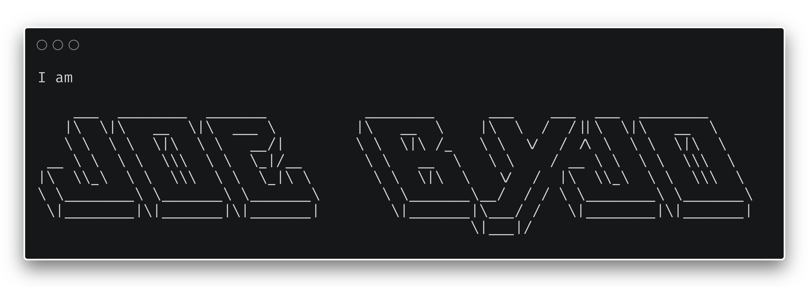

<!-- banner -->

<!-- socials -->

  
  
  

---

### 👨‍💻 About Me
- 🎓 2nd Year **Computer Science @ University of Adelaide** (Graduating 2026)  
- 🛠️ Exploring **Full-Stack Development**, **Linux/DevOps Automation**, and **Backend Systems**  
- 🚀 Aiming for roles in **Software Engineering**, **DevOps**, and **Automation Workflows**  
- ⚡ Currently tinkering with **homelabs, penetration testing, and workflow automations**  

---

<!-- badges -->
<h1></h1>

  

    <h4>
      Technologies I'm familiar with:
    </h4>
    
  

  
    
  
  

    
    
  

    
    
  <h1></h1>

